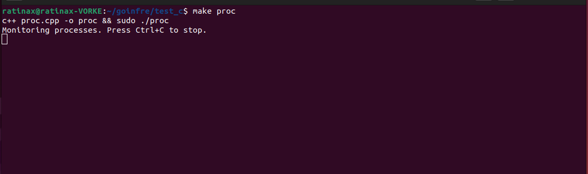
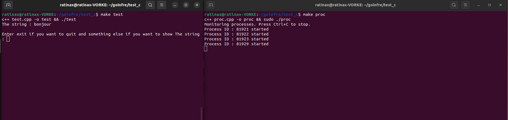
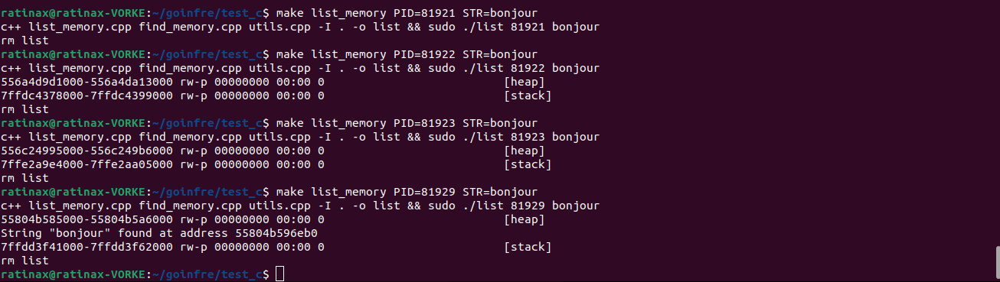
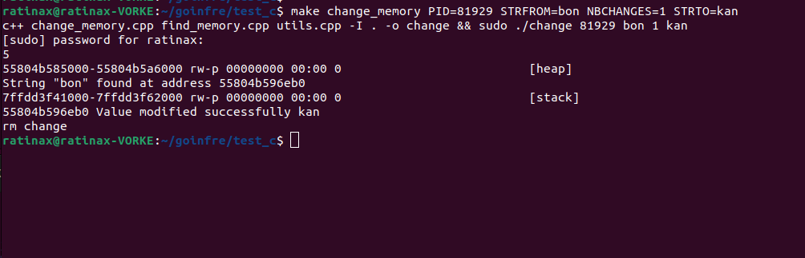
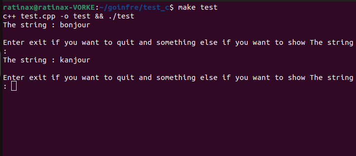
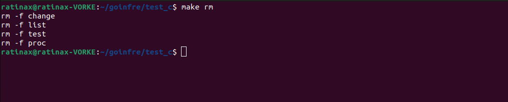

# Ft_transcendence

<!-- TABLE OF CONTENTS -->

  
Table of Contents

  <ol>
    <li>
      <a href="#about-the-project">About The Project</a>
      <ul>
        <li><a href="#built-with">Built With</a></li>
      </ul>
    </li>
    <li>
      <a href="#getting-started">Getting Started</a>
      <ul>
        <li><a href="#prerequisites">Prerequisites</a></li>
      </ul>
    </li>
    <li><a href="#Execution">Execution</a></li>
    <li><a href="#Annex">Annex</a></li>
  </ol>

<!-- ABOUT THE PROJECT -->
## About The Project

This is a C / C++ project. The aim is to change a string in the memory of another process while it's running.

(<a href="#readme-top">back to top</a>)

### Built With

(<a href="#readme-top">back to top</a>)

<!-- GETTING STARTED -->
## Getting Started
### Prerequisites

* Being on linux
* Having sudo privileges

## Execution

* First we have to find which pid the program is so we launch make proc, listing  new proc that last more than 30 seconds

* Than we execute our program and after 30 seconds we ca see some process starting

* To know which process is the one we are looking for, we look for the one with the string "bonjour" in its memory

* After findig it (81929), we can change the string "bonjour" to another one with :

In the case we have a string like "bonjourbonjour" and we want to replace each "bonjour" by "hellocc" we'll put NBCHANGES=2
* Then we can see the change done to the memory

* If you want to remove all the binary files

## Annex

If the string is too short like "b" you'll probably face some problem like finding alot of b's in the memory.
We just keep process that last longer than 30 second to decrease the amount of temporary process in proc output.
If it's too long for you, you can adjust this time by modifying PROCCESS_TIME.

(<a href="#readme-top">back to top</a>)

